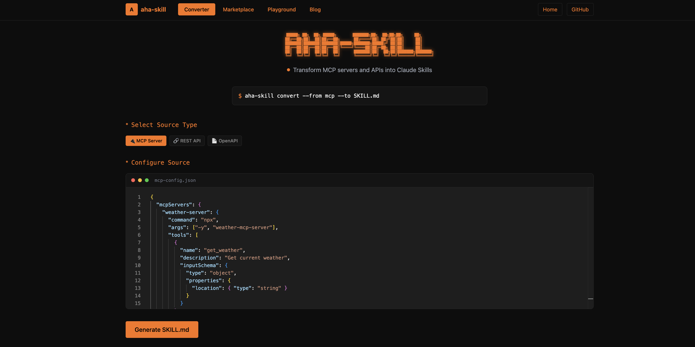
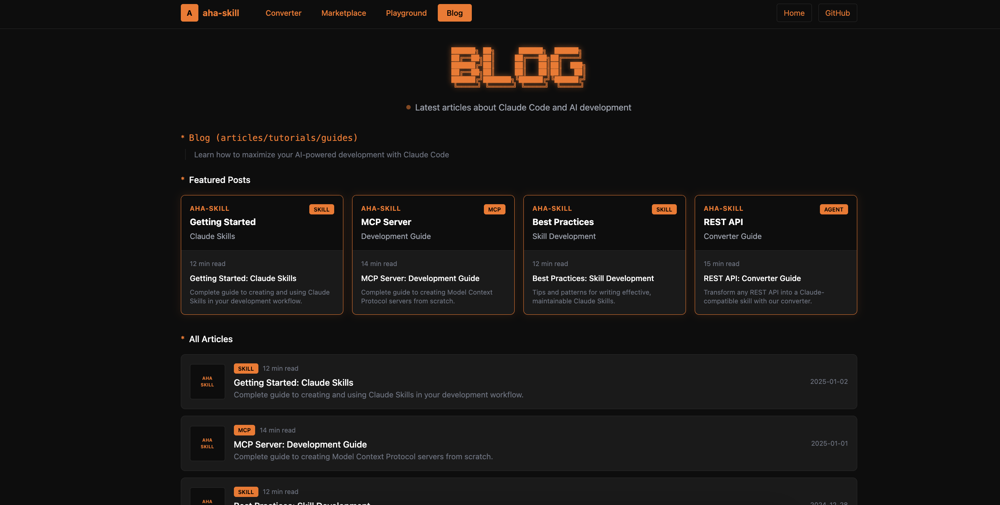
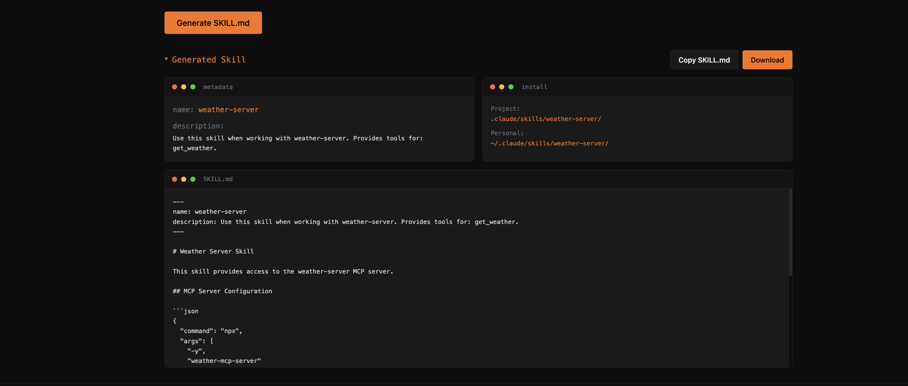

# Aha-Skill

> 🚀 将 MCP Server、REST API、OpenAPI 一键转换为 Claude Skill 包的平台



## ✨ 特性

- 🔄 **多源转换** - 支持 MCP Server、REST API、OpenAPI 规范转换
- 📦 **一键打包** - 自动生成标准 Claude Skill 包
- ✅ **智能验证** - 内置 Skill 包格式校验
- 🧪 **沙盒测试** - 安全的运行时测试环境

## 📸 界面预览

| 转换配置 | 结果预览 |
|:---:|:---:|
|  |  |

## 🏗️ 架构

```
┌─────────────────┐     ┌─────────────────┐
│   React Web     │────▶│   API Gateway   │
│   (Port 3000)   │     │   (Port 8000)   │
└─────────────────┘     └────────┬────────┘
                                 │
                    ┌────────────┴────────────┐
                    ▼                         ▼
          ┌─────────────────┐       ┌─────────────────┐
          │  Node Service   │       │ Python Service  │
          │  (Port 8001)    │       │  (Port 8002)    │
          │                 │       │                 │
          │ • REST API 转换 │       │ • MCP 转换      │
          │ • OpenAPI 转换  │       │ • Skill 验证    │
          │ • 打包          │       │ • 沙盒运行      │
          └─────────────────┘       └─────────────────┘
```

## 🚀 快速开始

### 使用 Docker Compose（推荐）

```bash
docker-compose up
```

访问 http://localhost:3000 即可使用 Aha-Skill。

### 本地开发

1. **安装依赖**

```bash
npm install
```

2. **启动 Python 服务**

```bash
cd apps/python-service
pip install -r requirements.txt
uvicorn app.main:app --port 8002 --reload
```

3. **启动 Node 服务**

```bash
cd apps/node-service
npm install
npm run dev
```

4. **启动 Gateway**

```bash
cd apps/gateway
npm install
npm run dev
```

5. **启动前端**

```bash
cd apps/web
npm install
npm run dev
```

## 📡 API 端点

| 端点 | 方法 | 说明 |
|------|------|------|
| `/api/convert/mcp` | POST | MCP 配置转换 |
| `/api/convert/rest` | POST | REST API 转换 |
| `/api/convert/openapi` | POST | OpenAPI 转换 |
| `/api/skill/validate` | POST | 验证 Skill 包 |
| `/api/skill/package` | POST | 打包 Skill |
| `/api/sandbox/run` | POST | 沙盒测试 |
| `/api/health` | GET | 服务健康检查 |

## 📦 Skill 包结构

```
skill-package/
├── manifest.json        # 元信息
├── tools/
│   └── definitions.json # 工具定义
├── prompts/
│   ├── system.md        # 系统提示词
│   └── examples.json    # 示例对话
└── config.json          # 配置文件
```

## 📄 License

MIT
